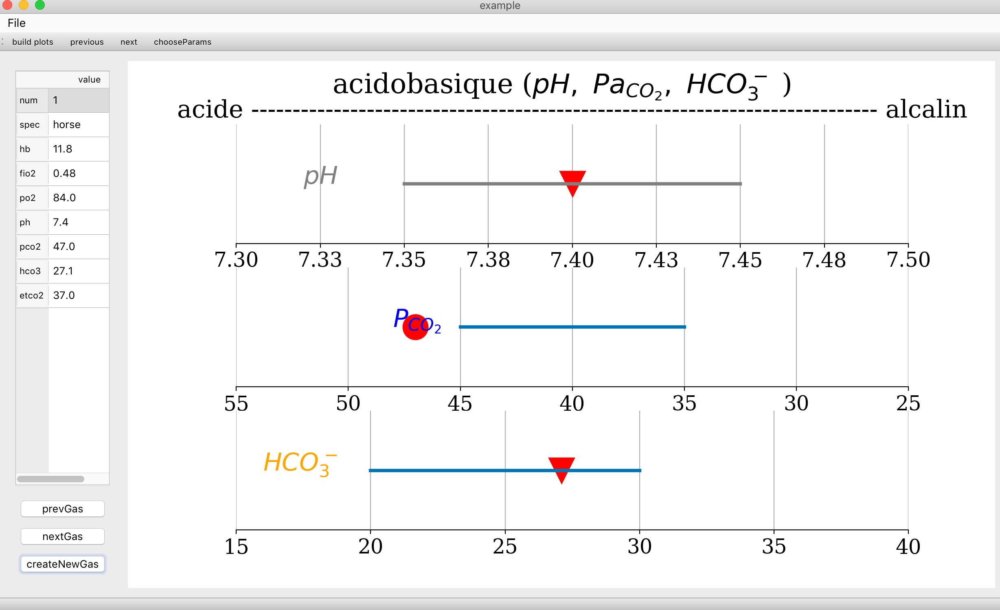
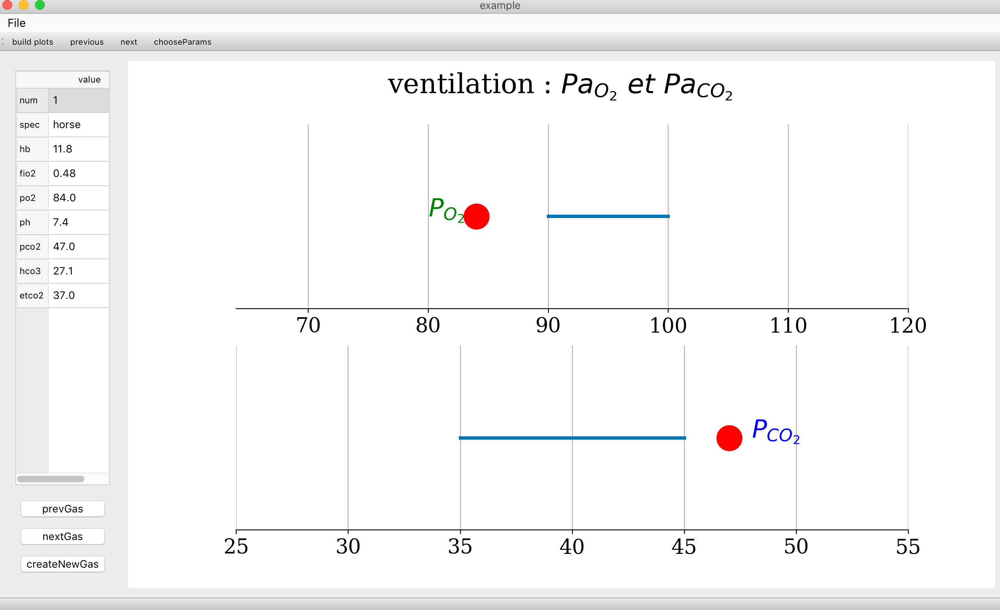
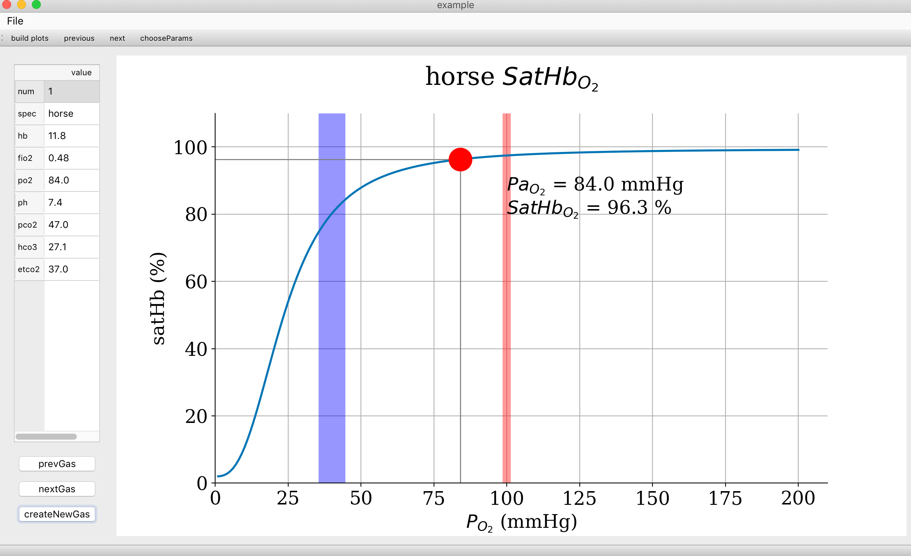
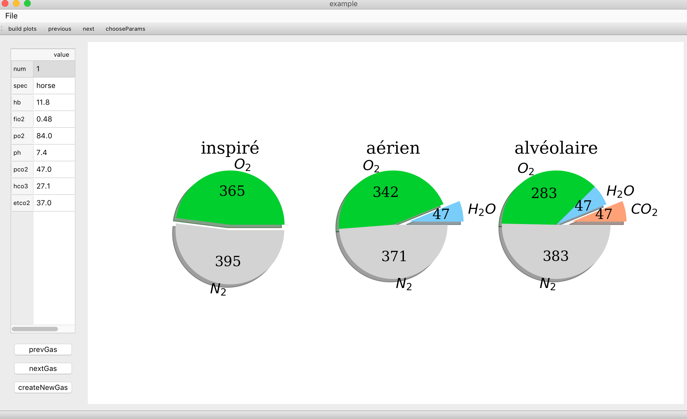
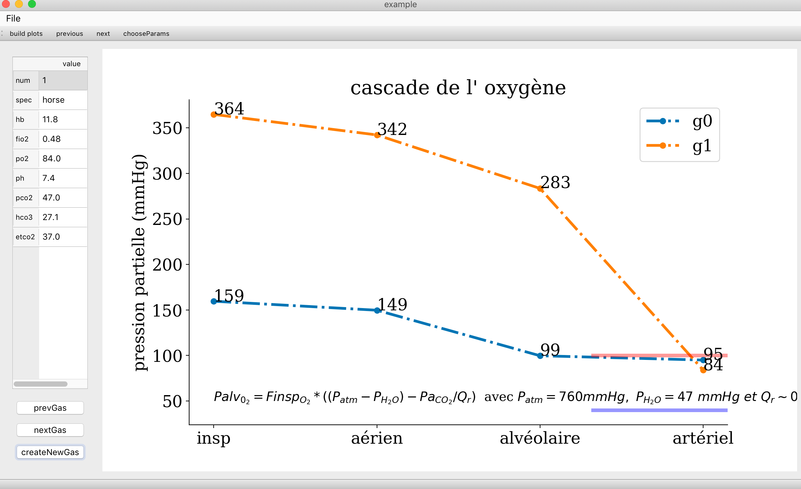

# bgplot

blood gases data plotting : 

- a simple qt5 interface to be used to plot arterial bloodGases values 

- useful for per-operative use and teaching
- run by using 'python bgMainGui.py'

## interface:

- cf examples below
- a left block to load the values
- buttons to build the plot series and navigate

## plots generated (examples)

- acido-basic status

- ventilatory status

- oxygenation

- oxygen cascade

- comparison with physiogical state

